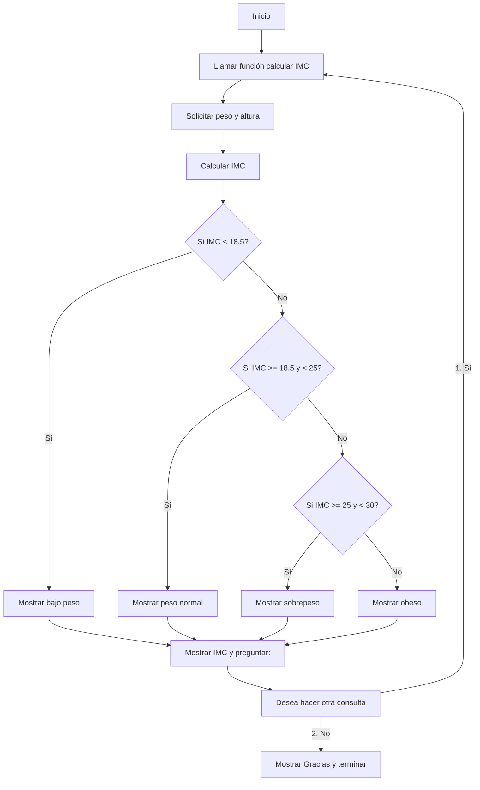
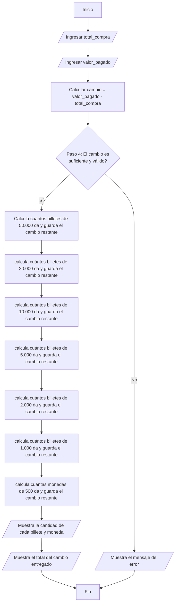

# programacion_20_agosto

```mermaid
graph TD
    A[Inicio] --> B["Llamar función calcular IMC"]

    B --> C["Solicitar peso y altura"]
    C --> D["Calcular IMC"]
    D --> E{"Si IMC < 18.5?"}
    E -- Sí --> F["Mostrar bajo peso"]
    E -- No --> G{"Si IMC >= 18.5 y < 25?"}
    G -- Sí --> H["Mostrar peso normal"]
    G -- No --> I{"Si IMC >= 25 y < 30?"}
    I -- Sí --> J["Mostrar sobrepeso"]
    I -- No --> K["Mostrar obeso"]

    F --> L
    H --> L
    J --> L
    K --> L["Mostrar IMC y preguntar: "]

    L --> M["Desea hacer otra consulta"]
    M -- "1. Sí" --> B
    M -- "2. No" --> N["Mostrar Gracias y terminar"]
```

```mermaid
flowchart TD
    A[Inicio] --> B[/Ingresar total_compra/];
    B --> C[/Ingresar valor_pagado/];
    C --> D[Calcular cambio = valor_pagado - total_compra];
    D --> E{Paso 4: El cambio es <br>suficiente y válido?};
    E -- Sí --> F[Calcula cuántos billetes de 50.000 da y guarda el cambio restante];
    F --> G[calcula cuántos billetes de 20.000 da y guarda el cambio restante];
    G --> H[calcula cuántos billetes de 10.000 da y guarda el cambio restante];
    H --> I[calcula cuántos billetes de 5.000 da y guarda el cambio restante];
    I --> J[calcula cuántos billetes de 2.000 da y guarda el cambio restante];
    J --> K[calcula cuántos billetes de 1.000 da y guarda el cambio restante];
    K --> L[calcula cuántas monedas de 500 da y guarda el cambio restante];
    L --> M[/Muestra la cantidad de cada billete y moneda/];
    M --> N[/Muestra el total del cambio entregado/];
    N --> O[Fin];
    E -- No --> P[/Muestra el mensaje de error/];
    P --> O;
```
