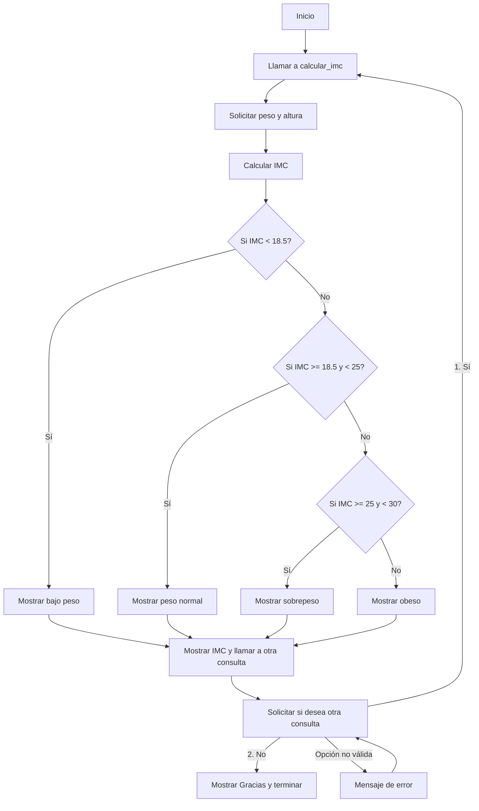

# programacion_20_agosto

```mermaid
graph TD
    A[Inicio] --> B["Llamar a calcular_imc"]

    B --> C["Solicitar peso y altura"]
    C --> D["Calcular IMC"]
    D --> E{"Si IMC < 18.5?"}
    E -- Sí --> F["Mostrar bajo peso"]
    E -- No --> G{"Si IMC >= 18.5 y < 25?"}
    G -- Sí --> H["Mostrar peso normal"]
    G -- No --> I{"Si IMC >= 25 y < 30?"}
    I -- Sí --> J["Mostrar sobrepeso"]
    I -- No --> K["Mostrar obeso"]

    F --> L
    H --> L
    J --> L
    K --> L["Mostrar IMC y llamar a otra consulta"]

    L --> M["Solicitar si desea otra consulta"]
    M -- "1. Sí" --> B
    M -- "2. No" --> N["Mostrar Gracias y terminar"]
    M -- "Opción no válida" --> O["Mensaje de error"]
    O --> M
```
