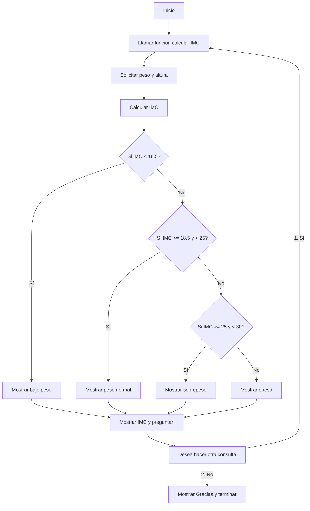

# programacion_20_agosto




```mermaid
graph TD
    A[Inicio] --> B(Ingresar total_compra y valor_pagado);
    B --> C{Calcular cambio};
    C --> D{Es el cambio >= 0 y múltiplo de 500?};
    D -- Sí --> E[Calcular cantidad de billetes y monedas];
    E --> F[Mostrar desglose del cambio];
    F --> G[Mostrar total de la devuelta];
    D -- No --> H[Mostrar mensaje de error];
    G --> I[Fin];
    H --> I;
