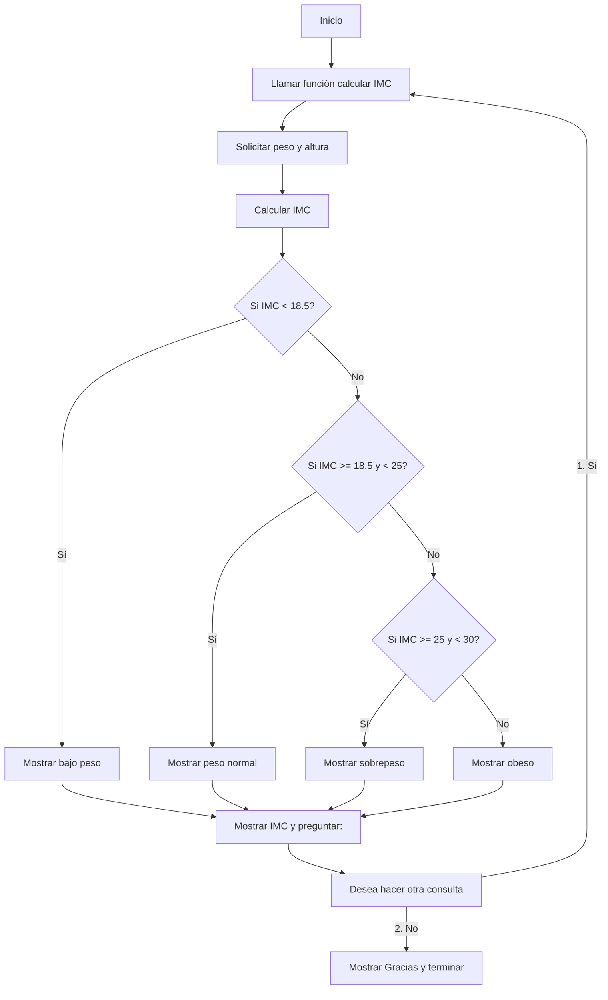
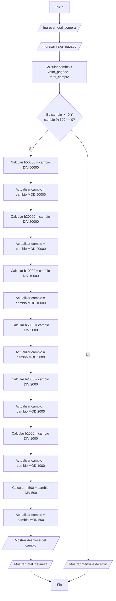

# programacion_20_agosto

```mermaid
graph TD
    A[Inicio] --> B["Llamar función calcular IMC"]

    B --> C["Solicitar peso y altura"]
    C --> D["Calcular IMC"]
    D --> E{"Si IMC < 18.5?"}
    E -- Sí --> F["Mostrar bajo peso"]
    E -- No --> G{"Si IMC >= 18.5 y < 25?"}
    G -- Sí --> H["Mostrar peso normal"]
    G -- No --> I{"Si IMC >= 25 y < 30?"}
    I -- Sí --> J["Mostrar sobrepeso"]
    I -- No --> K["Mostrar obeso"]

    F --> L
    H --> L
    J --> L
    K --> L["Mostrar IMC y preguntar: "]

    L --> M["Desea hacer otra consulta"]
    M -- "1. Sí" --> B
    M -- "2. No" --> N["Mostrar Gracias y terminar"]
```

```mermaid
flowchart TD
    A[Inicio] --> B[/Ingresar total_compra/];
    B --> C[/Ingresar valor_pagado/];
    C --> D[Calcular cambio = valor_pagado - total_compra];
    D --> E{Es cambio >= 0 Y<br>cambio % 500 == 0?};
    E -- Sí --> F[Calcular b50000 = cambio DIV 50000];
    F --> G[Actualizar cambio = cambio MOD 50000];
    G --> H[Calcular b20000 = cambio DIV 20000];
    H --> I[Actualizar cambio = cambio MOD 20000];
    I --> J[Calcular b10000 = cambio DIV 10000];
    J --> K[Actualizar cambio = cambio MOD 10000];
    K --> L[Calcular b5000 = cambio DIV 5000];
    L --> M[Actualizar cambio = cambio MOD 5000];
    M --> N[Calcular b2000 = cambio DIV 2000];
    N --> O[Actualizar cambio = cambio MOD 2000];
    O --> P[Calcular b1000 = cambio DIV 1000];
    P --> Q[Actualizar cambio = cambio MOD 1000];
    Q --> R[Calcular m500 = cambio DIV 500];
    R --> S[Actualizar cambio = cambio MOD 500];
    S --> T[/Mostrar desglose del cambio/];
    T --> U[/Mostrar total_devuelta/];
    U --> V[Fin];
    E -- No --> W[/Mostrar mensaje de error/];
    W --> V;
```
    G --> I[Fin];
    H --> I;
